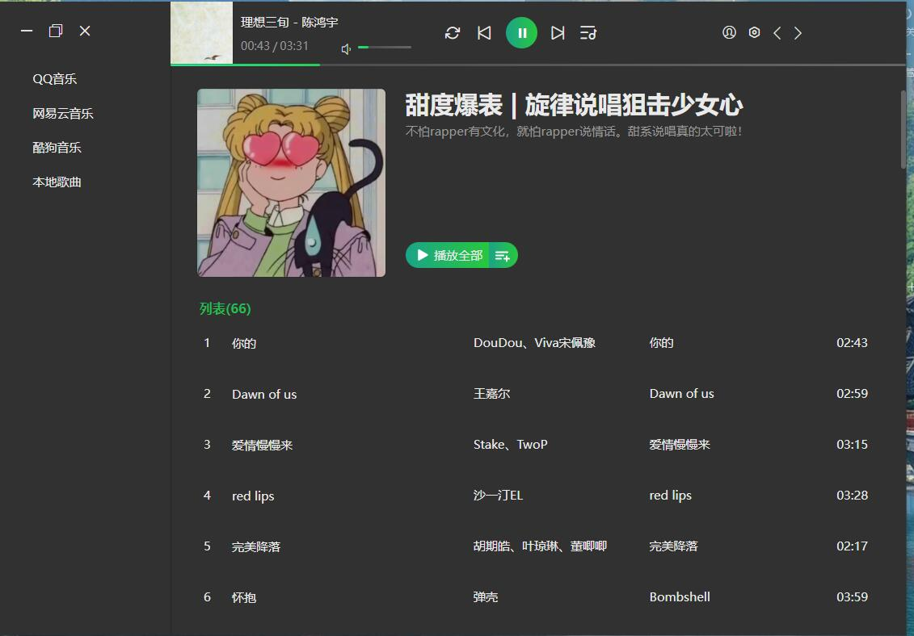
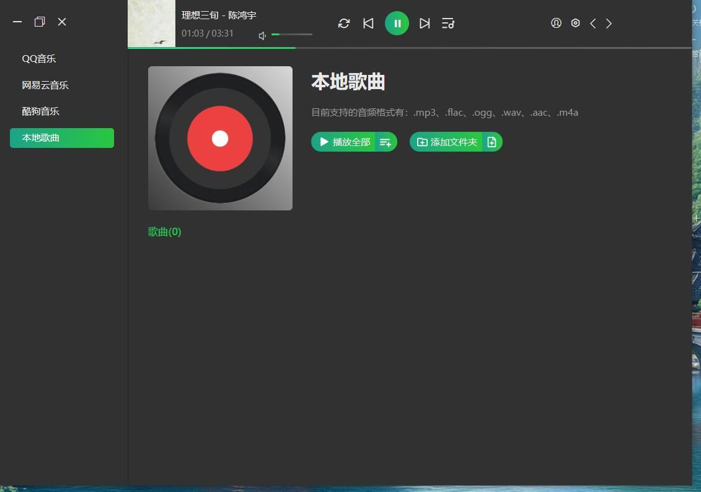
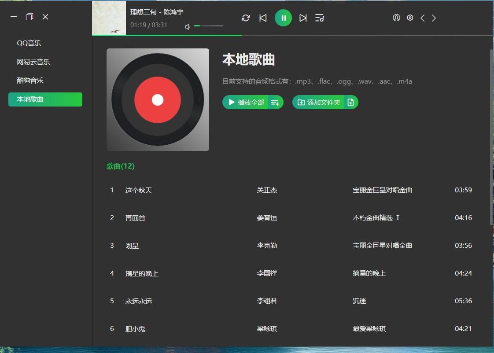

# MuBox 音乐盒

## 项目介绍

Tauri2 + vue3 技术栈

## 项目介绍

播放网络音乐，支持 mp3、flac、ogg、wav、aac、m4a 等格式。

## 代码参考

前端参考:
electron 项目 ：https://github.com/GeekLee2012/Less-Player-Desktop

## 显示图







## TODO

- [X] v0.1.1 支持版本更新

## 安装

下载
```
 git clone https://github.com/laowus/mu.git

```

安装依赖
`
cd mu
npm install / pnpm install / yarn

`
运行调试:

`  
pnpm tauri dev

`

打包:

`
pnpm tauri build

`

## 其他

再次郑重声明：本项目仅供学习交流，请支持正版！若谁做非法用途，后果自负！
